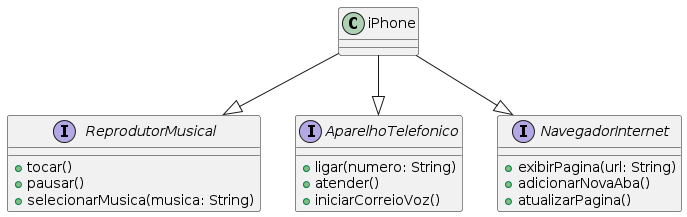

Visão Geral

Este projeto tem como objetivo modelar e diagramar o componente iPhone, representando suas funcionalidades principais: reprodutor musical, aparelho telefônico e navegador na internet. A modelagem é feita utilizando diagramas UML (Unified Modeling Language) para uma clara visualização da estrutura do componente e suas interações. Em seguida, as classes e interfaces correspondentes são implementadas em Java.

Funcionalidades

Reprodutor Musical
Métodos:
tocar(): Inicia a reprodução de uma música.
pausar(): Pausa a reprodução da música.
selecionarMusica(String musica): Seleciona uma música específica para reprodução.

Aparelho Telefônico
Métodos:
ligar(String numero): Realiza uma chamada telefônica para o número especificado.
atender(): Atende uma chamada telefônica.
iniciarCorreioVoz(): Inicia o correio de voz.

Navegador na Internet
Métodos:
exibirPagina(String url): Exibe uma página da web a partir da URL fornecida.
adicionarNovaAba(): Adiciona uma nova aba no navegador.
atualizarPagina(): Atualiza a página atual.

Diagrama UML
O diagrama de classes UML apresenta a estrutura do componente iPhone e suas interfaces, destacando a implementação dos métodos necessários para cada funcionalidade.

